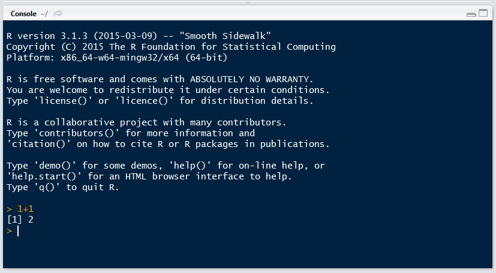
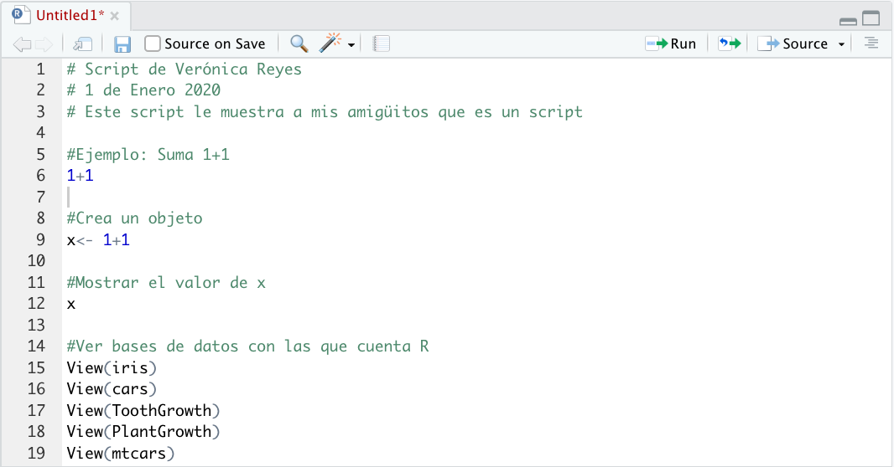
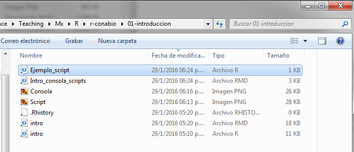

# CLASE 1.2: Introducción a R


Ross Ihaka y Robert Gentleman desarrollaron R como un entorno de software libre para sus clases de enseñanza cuando eran colegas en la Universidad de Auckland en Nueva Zelanda.


Como ambos estaban familiarizados con S, un lenguaje de programación para estadísticas, parecía natural utilizar una sintaxis similar en su propio trabajo. Después de que Ihaka y Gentleman anunciaron su software en la lista de correo de S ‐ news, varias personas se interesaron y comenzaron a colaborar con ellos.
Actualmente, un grupo de 21 personas tiene derecho a modificar el archivo central del código fuente (http://www.r‐project.org/ contributors.html). Este grupo se conoce como el Equipo R Core. Además, muchas otras personas han contribuido con nuevos códigos y correcciones de errores al proyecto.
Aquí hay algunas fechas clave en el desarrollo de R:

* Principios de la década de 1990: comenzó el desarrollo de R.
* Agosto de 1993: el software se anunció en la lista de correo de S-news. Desde entonces, se ha creado un conjunto de listas de correo R activas. La página web en www.r ‐ project. org / mail.html proporciona descripciones
de estas listas e instrucciones para suscribirse.
* Junio ​​de 1995: después de algunos argumentos persuasivos de Martin Mächler (entre otros) para que el código esté disponible como "software libre", el código se puso a disposición bajo la Licencia Pública General GNU (GPL) de la Free Software Foundation, Versión 2.
* Mediados de 1997: se formó el Equipo Central de Desarrollo R inicial (aunque, en ese momento, simplemente se conocía como el grupo central).
* Febrero de 2000: se lanzó la primera versión de R, la versión 1.0.0.
* Octubre de 2004: Lanzamiento de R versión 2.0.0.
* Abril de 2013: Lanzamiento de R versión 3.0.0.


### ¿Qué es R?

* R es un lenguaje de programación y un ambiente de cómputo estadístico
* R es software libre (libertad de usar, estudiar, distribuir y mejorar), de código abierto (todo el código de R se puede inspeccionar - y se inspecciona).
* Cuando instalamos R, instala la base de R. Mucha de la funcionalidad adicional está en **paquetes** que la comunidad crea y cada usuario es libre de incluir en su ambiente R.

### ¿Por qué utilizar R?
* R funciona en casi todas las plataformas (Mac, Windows, Linux).
* R es un lenguaje de programación completo, permite desarrollo de DSLs (funciones muy específicas)
* R promueve la investigación reproducible: no sólo de análisis sino de cómo se hicieron las figuras.
* R está actualizado gracias a que tiene una activa comunidad. Solo en CRAN hay cerca de 8000 paquetes.
* R se puede combinar con herramientas bioinformáticas y formatos de datos procesados (e.g. plink, vcf, bam, etc) para realizar análisis y figuras.
* R es popular como herramienta estadística y también como herramienta bioinformática.

### Dónde podemos aprender R

Gracias a los avances tecnológicos podemos tener acceso al conocimiento desde nuestro celular a diferentes medios:

* Blogs [r-bloggers](https://www.r-bloggers.com)
* Youtubers [latincoder](https://www.youtube.com/watch?v=S9u8JGJr2OY), [edureka!](https://www.youtube.com/watch?v=fDRa82lxzaU)
* Libros(vieja y confiable en bibliotecas o descargas) [Getting Started with R: An introduction for biologists](https://www.amazon.es/Getting-Started-R-introduction-biologists/dp/0199601623), [R learning](https://www.amazon.es/Learning-R-Richard-Cotton/dp/1449357105/ref=sr_1_8?s=foreign-books&ie=UTF8&qid=1530909258&sr=1-8&keywords=R+programming)
* Redes sociales [R-bloggers Twitter](https://twitter.com/rbloggers?lang=es), [R project en Español Facebook](https://www.facebook.com/groups/rprojectsp/about/), [R Facebook](https://www.facebook.com/Rprogrammingfun/), [R computing Facebook] (https://www.facebook.com/rcomputing/)
* Encuentros [R-ladies](https://www.meetup.com/es/rladiescdmx/)


### Descargar R y RStudio

Para comenzar se debe descargar [R](https://cran.r-project.org), esta descarga incluye R básico y un editor de textos para escribir código. Después de descargar R se recomienda descargar [RStudio](https://www.rstudio.com/products/rstudio/download/) (gratis y libre).

**RStudio** es un ambiente de desarrollo integrado para R: incluye una consola, un editor de texto y un conjunto de herramientas para administrar el espacio de trabajo cuando se  utiliza R. Tiene la misma disponibilidad que R(Windows, Mac y Linux).


### ¿Cómo entender R?
* Hay una sesión de R corriendo. La consola de R es la interfaz entre R y nosotros.
* En la sesión hay objetos. Todo en R es un objeto: vectores, tablas,  funciones, etc.
* Operamos aplicando funciones a los objetos y creando nuevos objetos.

##### La consola
Es una ventana que nos permite comunicarnos al motor de R. Esta ventana acepta **comandos** en el lenguaje de R y brinda una respuesta (resultado) a dichos comandos.


Por ejemplo, le podemos pedir a R que sume 1+1 así:

```
1+1
```    

La consola se distingue por tener el símbolo `>` (prompt)seguido de un cursor parpadeante que espera a que le demos instrucciones (cuando recién abrimos R además muestra la versión que tenemos instalada y otra info).

La consola debe verse más o menos así después del ejemplo anterior (1+1):




##### Scripts y el editor

Un **script** es un archivo de nuestros análisis que es:

* un archivo de texto plano
* permanente,
* repetible,
* anotado y
* compartible


Un script es una recopilación por escrito de las instrucciones que queremos enviar a la consola, de modo que al tener esas instrucciones cualquiera pueda repetir el análisis tal cual se hizo.

Un script muy sencillo podría verse así:




RECUERDEN que deben poner al inicio quien hizó el Script, que día y que hace.

"Ejemplo_script.R" es el nombre del archivo, es decir, que este texto es un **archivo de texto** (con terminación .R en vez de .txt) que vive en mi computadora.



RStudio brinda además de la consola un editor de texto, que es la pantalla que se observa en el ejemplo anterior. Lo que escribas en el editor de texto puede "enviarse" a la consola con los shortcuts de abajo o con el ícono `RUN`.

La idea es que en el editor de texto vayas escribiendo los comandos y comentarios de tu **script** hasta que haga exactamente lo que quieras.


### Algunos _shortcuts_ útiles en RStudio son:

**En el editor**  

* command/ctrl + enter: enviar código a la consola  
* ctrl + 2: mover el cursor a la consola

**En la consola**  

* flecha hacia arriba: recuperar comandos pasados  
* ctrl + flecha hacia arriba: búsqueda en los comandos  
* ctrl + 1: mover el cursor al editor  
* ? + nombre de función: ayuda sobre esa función.


# EJERCICIOS

1. Descarga e instala R y Rstudio
2. Explora el ambiente de R
3. Crea un directorio para guardar todos los ejercicios hechos en clase

# TAREA
1. Hacer una cuenta en GitHub
2. Instalar [Desktop GitHub](https://desktop.github.com/) y [Atom](https://atom.io/)
3. Traer una base de datos con la cual trabajar en la próxima clase e imagenes que quisieran poder realizar
4. Buscar en [Dryad](https://datadryad.org/stash) algun articulo que les interese por los analisis bioinformaticos  y las figuras que tienen (que quieran llegar a realizar durante el curso).
